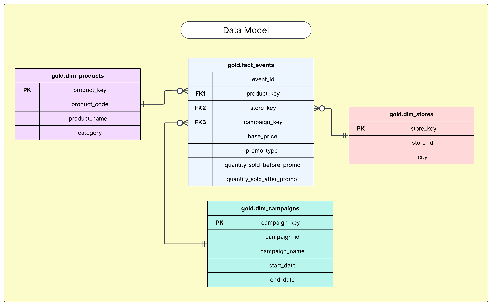

# Retail Events Data Warehouse & Analytics Project

## Transforming Raw Retail Data into Strategic Insights

Welcome to my Retail Events Analytics portfolio project! This repository showcases an end-to-end data solution that I designed to help retail businesses make data-driven decisions about their promotional events and campaigns.

---

## 📊 Project Overview

Every retailer faces critical questions about their promotions:
- "Which campaigns are driving the most revenue?"
- "Are our discount strategies working effectively?"
- "How do promotional events impact different product categories?"

I built this solution to answer these questions through a carefully architected data warehouse and intuitive visualizations that transform complex data into actionable insights.

---

## 🏗️ The Architecture Behind the Analysis

I implemented the industry-standard **Medallion Architecture**, creating a robust data pipeline with three distinct layers:


### The Data Journey:

**Bronze Layer**: Raw data ingestion
- Captures unaltered data from source CSV files
- Preserves data lineage and enables reprocessing if needed
- Establishes the foundation for all downstream analytics

**Silver Layer**: Data refinement
- Cleanses and standardizes data formats
- Validates data against business rules
- Resolves inconsistencies and handles missing values
- Creates reliable datasets for analysis

**Gold Layer**: Business intelligence
- Implements a dimensional star schema for efficient querying
- Creates pre-aggregated views for common analysis patterns
- Optimizes for reporting performance and usability
- Provides business-ready datasets tailored for stakeholder needs
  


This architecture ensures data quality while maintaining flexibility for evolving business requirements.

---

## 💡 Key Analytical Findings

My analysis uncovered several actionable insights that can directly impact business strategy:

### Promotion Strategy Effectiveness


- **BOGOF Dominance**: The Buy One Get One Free promotion dramatically outperformed all other types, generating over 200,000 units in post-promotion sales—more than double the next best performer
- **Discount Paradox**: Despite offering the highest monetary value, the 50% OFF promotion showed surprisingly low effectiveness, suggesting consumers respond more to the perception of "getting something free" than equivalent percentage discounts
- **Pre/Post Comparison**: Analysis of baseline (pre-promotion) sales versus promotional period revealed BOGOF not only had the highest absolute sales but also generated the greatest sales uplift
- **Strategy Recommendation**: Prioritize BOGOF promotions for high-velocity products where margin can support the strategy

### Product & Category Performance

- **Staples Lead**: Atliq Farm Chakki Atta (1KG) emerged as the top-performing product with approximately 80,000 units sold, followed by Atliq Sunflower Oil (1L) at about 70,000 units
- **Category Dominance**: Grocery & Staples account for 56.6% of total promotional sales, confirming the strategy of using essential items as promotional drivers
- **Hidden Opportunity**: Despite representing only 7.2% of total sales, the Personal Care category includes high-performing products like Atliq Lime Cool Bathing Bar, suggesting potential for expanding promotion of higher-margin personal care items

### Campaign & Seasonal Impact

- **Festival Effect**: The Diwali campaign generated 153,338 units—over twice the sales volume of the Sankranti campaign (73,085 units)
- **Seasonal Planning**: This 110% performance difference highlights the importance of aligning promotional resources with cultural festivals that drive consumer purchasing behavior
- **Year-Round Strategy**: Analysis suggests a strategy of major resource allocation to top-performing seasonal campaigns while maintaining smaller, targeted promotions during other periods

### Geographic Distribution

- **Market Concentration**: The top three cities (Bengaluru, Chennai, and Hyderabad) account for approximately 60% of total promotional sales (257,813 units)
- **Expansion Potential**: The steep drop-off to mid-tier cities (Coimbatore through Madurai, each at 30,000-40,000 units) reveals untapped potential for targeted expansion
- **Localization Opportunity**: Cross-analysis of city performance with promotion types suggests opportunities for city-specific promotional strategies

---

## 🛠️ Technical Implementation

### Data Engineering Excellence

- **ETL Pipeline**: Custom SQL Server stored procedures that handle incremental data loading
- **Data Quality Management**: Validation rules enforced during the Silver layer transformation
- **Performance Optimization**: Indexed views and smart partitioning for query efficiency
- **Documentation**: Comprehensive data dictionary and lineage tracking

### Advanced SQL Techniques

- Window functions for time-series analysis
- CTEs and subqueries for complex metric calculations
- Dynamic SQL for flexible reporting parameters
- Statistical calculations for significance testing

### Data Visualization

My Tableau dashboard provides an intuitive interface for business users to:
- Filter insights by time period, region, or product category
- Drill down from high-level metrics to granular details
- Compare campaign performance side-by-side
- Export findings for stakeholder presentations

---

## 📂 Repository Structure

```
retail-events-project/
│
├── datasets/                       # Source data files
│
├── docs/                           # Documentation and diagrams
│   ├── data_architecture.drawio.png
│   ├── data_flow.drawio.png
│   ├── data_model.drawio.png
│   ├── promotion_performance.png
│
├── scripts/                        # SQL implementation
│   ├── init_database.sql           # Database initialization
│   ├── ddl_bronze.sql              # Bronze layer schema
│   ├── ddl_silver.sql              # Silver layer transformations
│   ├── ddl_gold.sql                # Gold layer dimensional model
│   ├── proc_load_bronze.sql        # Data ingestion procedures
│   ├── proc_load_silver.sql        # Data cleansing procedures
│   ├── gold_views.sql              # Analytical views
│   ├── analysis_queries/           # Advanced analytical queries
│      ├── promotion_effectiveness.sql
│      ├── product_performance.sql
│      ├── campaign_comparison.sql
│      ├── geographic_analysis.sql
│
├── tableau/                        # Visualization assets
│   ├── Retail_Events_Insights.twbx # Interactive dashboard
│
├── ad-hoc-requests.pdf             # Business requirements
└── README.md                       # Project documentation
```

---

## 🚀 Strategic Recommendations

Based on the comprehensive analysis, I've developed these actionable recommendations:

1. **Promotion Optimization**
   - Increase BOGOF promotions for high-velocity essential items where margins allow
   - Reconsider 50% OFF promotions or test alternative messaging to improve perception
   - Develop hybrid promotion strategies that combine the psychological appeal of BOGOF with sustainable economics

2. **Category Expansion**
   - Maintain strong promotional focus on Grocery & Staples as traffic drivers
   - Strategically expand promotions in the Personal Care category, targeting items with demonstrated promotion responsiveness
   - Test bundle promotions that pair high-performing staples with higher-margin personal care items

3. **Seasonal Allocation**
   - Allocate promotional budget with a 2:1 ratio favoring Diwali over Sankranti based on historical performance
   - Develop Diwali-specific product bundles focused on top-performing categories
   - Create targeted smaller promotions for Sankranti with region-specific approaches

4. **Geographic Strategy**
   - Maintain strong promotional presence in top-performing cities
   - Develop tailored expansion strategies for mid-tier cities showing growth potential
   - Consider city-specific promotion types based on local performance data

---

## 🔍 Key Takeaways

This project demonstrates my ability to:

- Transform business questions into technical requirements
- Architect scalable data solutions following industry best practices
- Implement robust ETL processes with proper error handling
- Apply advanced analytical techniques to derive meaningful insights
- Translate data findings into concrete business recommendations
- Bridge the gap between technical implementation and business value

---

## 🔗 Connect With Me

I'm passionate about helping businesses leverage their data assets through thoughtful architecture and insightful analytics.

**Sai Suraj M.V.V.**  
Data Analytics Specialist

📧 [saisurajmvv@gmail.com](mailto:saisurajmvv@gmail.com)  
🔗 [LinkedIn](https://www.linkedin.com/in/saisurajmatta/)  
🌐 [Portfolio](https://saisurajmatta.github.io/Portfolio)  
💻 [GitHub](https://github.com/SaiSurajMatta)

*Looking for a data professional who can turn your business questions into actionable insights? Let's connect!*
